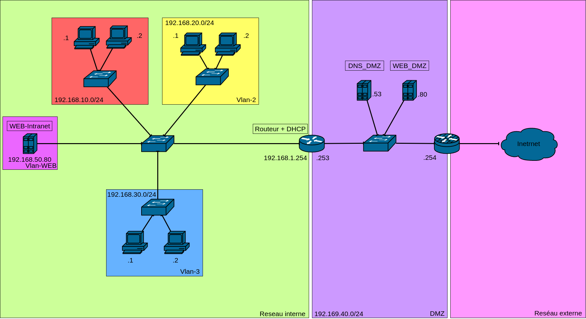

# SAE21_prive

Repository privé de la SAE21

Lors de cette SAE je me suis occupé de l'organisation, de la répartition des tâches et de ma partie a moi. Ma partie consiste à réaliser le schéma détaillé du réseau que l'on va constituer.

## Réseau réalisé

Ce schéma présente l'adressage choisi, et comment est organisée la répartition des VLAN.

En détail :

* Les VLAN sont en /24 avec le troisième octet qui correspond au nom du VLAN.
* Le DHCP se trouve sur le routeur ce qui permet d'éviter de faire tourner une machine de plus sur le réseau.
* La DMZ est sur un adressage privé sans DHCP car avec seulement 3 machines, les configurer manuellement est plus simple.

## Configuration du routeur

Voici la configuration du routeur que j'ai realisée (cette partie ne contient que les inforamtion realtive au "firewall", la configuration complete est [ici](./SAVE_router_MikroTik/conf_text_version.txt))

    [admin@MikroTik] /ip firewall> export 
    # apr/30/2022 21:20:43 by RouterOS 6.49.6
    # software id = 944W-E5JF
    #
    # model = RB750Gr3
    # serial number = CC210ED20FBE
    /ip firewall filter
    add action=accept chain=input connection-state=established,related
    add action=accept chain=input protocol=icmp
    add action=drop chain=input in-interface-list=!LAN
    add action=accept chain=forward connection-state=established,related,new dst-port=80 \
        in-interface=ether1 protocol=tcp
    add action=accept chain=forward connection-state=established,related,new dst-port=443 \
        in-interface=ether1 protocol=tcp
    add action=accept chain=forward connection-state=established,related,new dst-port=53 \
        in-interface=ether1 protocol=udp
    add action=accept chain=forward connection-state=established,related
    add action=drop chain=forward connection-state=invalid
    add action=drop chain=forward connection-nat-state=!dstnat connection-state=new \
        in-interface-list=WAN
    add action=accept chain=forward connection-state=established,related,new in-bridge-port-list=\
        LAN
    /ip firewall nat
    add action=masquerade chain=srcnat comment="defconf: masquerade" ipsec-policy=out,none \
        out-interface-list=WAN
    add action=dst-nat chain=dstnat dst-port=80 in-interface=ether1 protocol=tcp src-port=\
        !32768-61000 to-addresses=192.168.40.80 to-ports=80
    add action=dst-nat chain=dstnat dst-port=443 in-interface=ether1 protocol=tcp src-port=\
        !32768-61000 to-addresses=192.168.40.80 to-ports=443
    add action=dst-nat chain=dstnat dst-port=53 in-interface=ether1 protocol=udp src-port=\
        !54-61000 to-addresses=192.168.40.53 to-ports=53

En résumé, elle permet du D-NAT pour les serveurs DNS et WEB_DMZ, elle filtre aussi les paquets entrants et sortants de l'entreprise.

-------

## Page WEB

De plus j'ai realisé la "magnifique" page WEB pour notre entreprise.

-------
## Répartition des tâches

* DHCP / WEB-Intranet / ACL -> VALENTIN
* DMZ / schéma -> réseau MATHIEU
* DNS / WEB -> LUIGI

-------

## Journal de bord

24 / 03 -> TD présentation.

25 / 03 -> découverte du sujet.

28 / 03 -> début de travail sur nos parties respectives.

29 / 03 -> création des git (pour moi creation du schéma).

04 / 04 -> suite du travail.

11 / 04 -> TP -> réalisation du GNS3 des serveurs par Valentin et schéma fini en .dio par Mathieu.

14 / 04 -> travail continué.

15 / 04 -> découverte et création des DockerFiles.

Les dernieres séance m'on permit de finaliser les differantes configurations.

-------

## Notes prises le long de cette SAE

dot1q -> trunk

Deux type de NAT

source NAT (SNAT)

    TRAM traduite par le routeur avec une modification au niveau de l'IP source
    Le serveur parle au routeur 
    Il suit les numéros de connexion
    On ne le voit pas au niveau IP

DNAT :

    On va DNAT un port;
    Exemple : tout ce qui est connecté au port 80 va aller jusqu'au serveurs WEB.

Deux DNS : un récursif et un public.

Mettre sur le DNS pour le WEB-intra l'ip privé.

DMZ selon r/mikrotik : 

On refuse touteq les connexions de l'extérieur sur le routeur.
On va autoriser les connexions au port 80 qui vont être redirigé vers le serveur WEB.
On va autoriser les connexions au port 56 qui vont être redirigées vers le serveur DNS.
"Autorized" tout ce qui est "established".
Et on filtre les "new".
De même pour les serveurs pour les "updates".
Il faut aussi que je full NAT le Mikrotik.

NAT :

Créer un liste pour chaque sous interface et mettre le NAT pour chacune d'entre elles.
